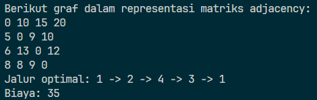

# TSP-Swift
> Penyelesaian Travelling Salesman Problem menggunakan Program Dinamis dalam Bahasa Swift

## Prinsip Kerja Program
Program ini menyelesaikan Travelling Salesman Problem dengan prinsip program dinamis. Misalkan simpul saat ini adalah `i` dan kumpulan simpul adalah `S`. Program ini mencari jalur dengan biaya terendah menggunakan relasi rekursif dengan mempertimbangkan semua kemungkinan simpul berikutnya `j` dari `S`. Biaya tersebut berupa biaya dari simpul `i` ke `j` dijumlahkan dengan jalur dari `j` ke simpul-simpul sisanya. Hasil perhitungan biaya dan jalur masing-masing disimpan dalam sebuah map untuk menghindari jalur yang duplikat dan mempermudah proses merekonstruksi jalur.

## Dependencies
Pastikan Anda memiliki [Swift](https://www.swift.org/install/linux/). Program ini dijalankan dan diuji dalam Swift versi 6.1.1. 

## Menjalankan Program
Silakan klon repositori ini.
```shell
git clone https://github.com/TukangLas21/TSP-Swift.git
cd TSP-Swift
```

Untuk mengompilasi dan menjalankan program ini, silakan ikuti perintah berikut.
```shell
swiftc solver.swift -o solver
./solver
```

## Uji Kasus


## Author
Aria Judhistira - 13523112

## Kesan Pesan
Bahasa Swift ternyata sangat mengesankan. Berikutnya, saya ingin membuat program bisa menerima input langsung dari pengguna, tetapi saya ingin tidur dulu saat ini :)
